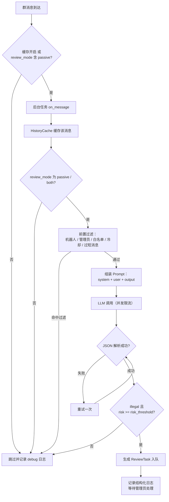
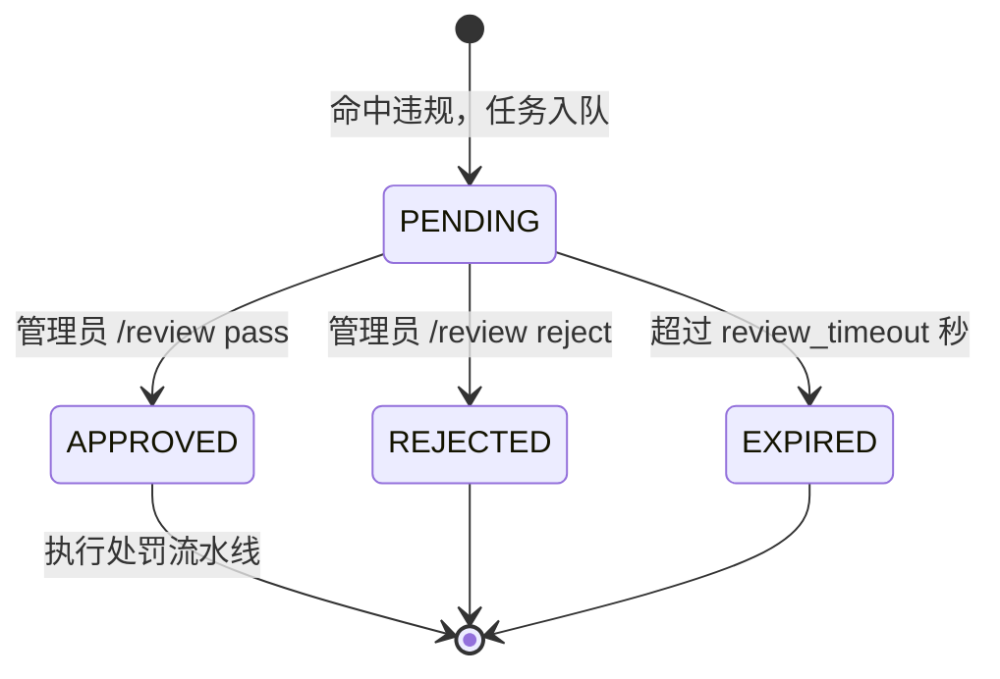

# astrbot_plugin_ai_review

基于 AstrBot 已接入大语言模型的群聊 AI 审核插件。

AI 自动分析群成员聊天记录，为管理员生成审核建议（风险值、违规类型、证据、建议处罚），
并生成待审核任务；管理员确认后由插件执行处罚流水线。

> **重要**：AI 仅负责辅助审核，**不直接处罚用户**；所有处罚行为必须由管理员通过 `/review pass` 人工确认后执行。

## 功能特性

- **主动审核**：`/review @成员`、`/review <uid>`、`/review recent`
- **被动审核**：收到群消息后后台自动分析（可配置触发模式，不阻塞消息响应）
- **审核队列**：待审核列表 / 详情 / 通过 / 拒绝，超时自动失效
- **处罚策略**：warn / mute / kick / ban / blacklist，流水线模式，可配置扩展
- **皮梦云黑库同步**：通过皮梦云黑库插件同步，未安装时自动跳过（弱依赖）
- **全异步**：被动审核以后台任务执行，任务异常有日志可查
- **配置热加载**：配置修改后即时生效（含处罚配置）
- **Prompt 外置**：审核规则与提示词独立存放于文本文件，可热加载
- **零第三方依赖**：仅使用 AstrBot 平台 API

## 安装

1. 将本插件目录放入 AstrBot 的插件目录（如 `addons/` 或 AstrBot 管理面板中指定的插件目录）；
2. 在 AstrBot 管理面板中启用插件；
3. 确认已配置可用的对话模型 Provider（聊天类模型）。

要求：Python 3.11+，AstrBot >= 4.13.0。

## 工作原理

### 总体架构

插件由 6 个核心模块协作完成审核，模块之间通过依赖注入（`get_config` 回调）解耦：

| 模块 | 职责 |
|------|------|
| `HistoryCache` | 按群缓存最近聊天记录（`deque`，容量由 `history_count` 控制） |
| `PromptManager` | 加载 `data/prompts/` 下的 Prompt 模板并组装（带 mtime 热加载） |
| `LLMClient` | 封装 AstrBot Provider 调用，支持并发限流与管理员异常通知 |
| `ReviewWorkflow` | 审核主流程：过滤 → 组装 → 调用 → 解析 → 阈值判定 → 入队 |
| `ReviewQueue` | 待确认审核任务队列（内存），支持超时自动失效 |
| `Punisher` | 按建议处罚类型执行有序处罚流水线（Strategy 模式） |

### 被动审核流程

群消息到达后，插件在后台任务中按以下流程处理：



说明：

- 记录先写入历史缓存再做过滤，因此管理员/机器人的发言也会进入缓存作为审核上下文（但不会触发审核）。
- 前置过滤包括：机器人自身消息、管理员/群主、白名单用户、冷却期内的重复触发、空消息与过短消息（`min_msg_len`）。
- 若 `enable_history=false`，被动审核仍可用：此时以触发审核的那条消息本身作为唯一上下文进行分析。
- LLM 返回的 JSON 解析失败会自动重试一次，仍失败则结束本次审核并记录错误日志。
- 风险判定采用 `illegal == true 且 risk >= risk_threshold` 双重条件，任一不满足即视为不违规。

### 主动审核流程

管理员执行 `/review @成员`、`/review <uid>` 或 `/review recent` 时：

1. 从该群历史缓存中取出目标用户的最近发言（或最近整段聊天记录）；
2. 与被动审核共用同一套 Prompt 组装、LLM 调用、解析与阈值判定流程；
3. 命中违规则生成审核任务并入队，管理员会立即收到包含任务 ID 的摘要；
4. 主动审核同样受白名单与冷却限制。

> 提示：`/review <uid>` 依赖历史缓存，请确保 `enable_history=true` 且该群已有消息被缓存。

### 审核任务状态机



- **通过**（`/review pass <id>`）：按 AI 建议的处罚类型执行整条处罚流水线，执行结果与审核日志一并记录；
- **拒绝**（`/review reject <id>`）：仅记录日志，不执行任何处罚；
- **超时**（`review_timeout` 秒）：任务自动失效，`/review list` / `detail` / `pass` 等操作会自动清理过期任务。

### 处罚流水线

处罚采用流水线模式：每种建议处罚对应一个有序阶段列表，依次执行，结果汇总返回给管理员。

| 建议处罚 | 默认流水线 | 阶段行为 |
|----------|-----------|---------|
| warn     | `warn` | 在群内发送警告消息（含原因） |
| mute     | `warn` → `mute` | 按 `mute_duration`（秒）禁言 |
| kick     | `warn` → `kick` | 将成员移出群聊 |
| ban      | `warn` → `ban` | 长期禁言（30 天） |
| blacklist| `warn` → `blacklist` | 同步至皮梦云黑库 |

可通过配置 `punish_pipeline` 覆盖默认流水线，例如：

```json
{"mute": ["warn", "mute"], "ban": ["ban"]}
```

阶段取值为 `warn` / `mute` / `kick` / `ban` / `blacklist`，可按需组合扩展。
未知阶段会跳过并在结果中提示；`blacklist` 阶段还会额外受 `enable_blacklist` 开关控制。

### 皮梦云黑库同步

当 `enable_blacklist=true` 且检测到 `astrbot_plugin_pimeng_blacklist` 插件已加载时，
`/review pass` 执行 `blacklist` 处罚会自动调用其 `api.add_to_blacklist` 接口同步黑库。

- 插件未安装 / 未启用 / 未配置 Bot Token 时自动跳过，不影响插件运行；
- 建议处罚到黑库等级的映射：warn→1、mute→2、kick/ban/blacklist→3。

### Prompt 系统

Prompt 文本独立存放于 `data/prompts/`（或配置 `prompt_path` 指向的自定义目录），修改文件后无需重启，自动生效：

| 文件 | 用途 | 占位符 |
|------|------|--------|
| `system.txt` | 系统审核规则与风险分级 | `{threshold}`（risk_threshold 值） |
| `user.txt` | 聊天记录模板 | `{records}`（格式化记录）、`{target}`（审核对象描述） |
| `output.txt` | 输出 JSON 格式约束 | 无 |
| `reason.txt` | `reason` 字段的格式化要求 | 无 |

AI 必须返回如下 JSON，`risk` 为 0~100 的整数，`suggestion` 只能取 `warn` / `mute` / `kick` / `ban` / `blacklist`：

```json
{
  "illegal": true,
  "risk": 92,
  "type": "辱骂",
  "reason": "...",
  "evidence": ["...", "..."],
  "suggestion": "mute"
}
```

解析器支持 Markdown 代码块包裹以及 JSON 前后存在杂散文本的情况，解析失败自动重试一次。

### 配置热加载

所有配置通过统一的 `ConfigManager` 读取，各模块在执行前通过 `get_config` 回调同步最新值，
因此 `history_count`、`review_mode`、`risk_threshold`、`cooldown`、`punish_pipeline`、
`mute_duration`、`enable_blacklist`、Prompt 目录等修改后**即时生效**，无需重启插件。

## 配置（后端配置操作）

### 配置方式一：AstrBot 管理面板（推荐）

1. 打开 AstrBot 管理面板（默认 `http://<AstrBot地址>:6185`）；
2. 进入「插件管理」，找到 `astrbot_plugin_ai_review`；
3. 点击「配置 / 设置」进入表单，按需修改各项参数并保存；
4. 表单由 `_conf_schema.json` 自动生成，包含类型、默认值、说明与可选值（如 `review_mode`）。

### 配置方式二：/reviewconfig 命令（管理员）

在群聊中直接执行：

```text
/reviewconfig                 查看当前全部配置
/reviewconfig <key> <value>   修改配置并持久化
```

示例：

```text
/reviewconfig review_mode active
/reviewconfig risk_threshold 70
/reviewconfig whitelist 10001,10002
/reviewconfig mute_duration 1200
/reviewconfig punish_pipeline {"mute": ["warn", "mute"], "ban": ["ban"]}
```

说明：

- 列表类配置（如 `whitelist`、`admin_qq`）用英文逗号分隔；
- JSON 类配置（如 `punish_pipeline`）支持直接粘贴含空格的完整 JSON；
- `review_mode` 仅接受 `active` / `passive` / `both`，其他值会被拒绝；
- 修改成功后立即生效，并同步持久化到 AstrBot 配置文件中。

### 配置方式三：手动编辑配置文件

配置实际存储于 AstrBot 的配置目录中（通常为 AstrBot 根目录下的 `data/config/astrbot_plugin_ai_review_config.json`）：

1. 关闭 AstrBot 或先在管理面板禁用插件；
2. 编辑该 JSON 文件，保持 JSON 语法合法；
3. 重新启用插件或重启 AstrBot。

> 不建议在插件运行时手动编辑文件，配置可能被内存中的值覆盖。

### 配置项总表

| 配置项 | 类型 | 默认值 | 说明 |
|--------|------|--------|------|
| `history_count` | int | 50 | 每个群缓存最近聊天条数 |
| `review_mode` | string | both | 触发模式：`active`（仅主动）/ `passive`（仅被动）/ `both` |
| `risk_threshold` | int | 80 | AI 风险值低于该值视为不违规 |
| `review_timeout` | int | 300 | 审核任务超时（秒），超时自动失效 |
| `cooldown` | int | 300 | 同一用户两次自动审核最小间隔（秒） |
| `enable_blacklist` | bool | false | 是否启用皮梦云黑库同步 |
| `enable_history` | bool | true | 是否启用聊天记录缓存（关闭后主动审核 `uid` 无历史可用） |
| `prompt_path` | string | 空 | 自定义 Prompt 目录，留空使用内置 `data/prompts` |
| `whitelist` | list | [] | 白名单用户 ID，不参与自动审核 |
| `min_msg_len` | int | 2 | 短于该长度的消息不触发被动审核 |
| `llm_max_concurrency` | int | 3 | 同时进行的模型请求数上限（最小 1） |
| `mute_duration` | int | 600 | mute 处罚禁言时长（秒） |
| `admin_qq` | list | [] | AI 调用异常时向其发送告警私聊的管理员 QQ |
| `max_chat_chars` | int | 3000 | 发送给 AI 的聊天记录总字符预算，超出丢弃更早的记录 |
| `max_msg_chars` | int | 200 | 单条消息发送给 AI 的字符上限，超出截断 |
| `punish_pipeline` | object | {} | 处罚流水线映射（键为建议处罚，值为有序阶段列表） |

### 常见配置场景

- **仅主动审核**：`review_mode=active`（群消息只缓存，不自动分析）
- **仅被动审核**：`review_mode=passive`；若同时关闭缓存（`enable_history=false`），每次以触发消息本身为上下文审核
- **降低误报**：`risk_threshold=85` 或调高 `min_msg_len`、增加白名单
- **提高敏感度**：`risk_threshold=70`
- **避免同一用户频繁触发**：调大 `cooldown`
- **自定义处罚**：`punish_pipeline={"kick": ["warn", "kick"]}`
- **接入皮梦云黑库**：`enable_blacklist=true`，并确保皮梦云插件已启用且配置了 Bot Token
- **管理员告警**：`admin_qq=["10000"]`（AI 调用失败时私聊通知）

## 命令（管理员）

| 命令 | 说明 |
|------|------|
| `/review @成员` | 审核指定群成员（@ 提及） |
| `/review <uid>` | 审核指定 QQ / 平台用户 ID |
| `/review recent` | 审核最近整段聊天记录 |
| `/review list` | 查看待审核任务（最多 10 条） |
| `/review detail <id>` | 查看任务详情（证据、聊天上下文） |
| `/review pass <id>` | 通过任务并执行处罚流水线 |
| `/review reject <id>` | 拒绝任务（不处罚，仅记录日志） |
| `/reviewconfig` | 查看全部配置 |
| `/reviewconfig <key> <value>` | 修改配置并持久化 |

## 目录结构

```
main.py              插件入口（模块装配、消息监听、命令注册、后台任务管理）
config.py            配置中心（默认值、类型转换、校验、持久化）
models.py            数据模型（dataclass：ChatRecord / ReviewResult / ReviewTask / ReviewLog）
prompt.py            Prompt 构建与热加载
review/
  history.py         聊天记录缓存（deque）
  workflow.py        审核工作流（过滤 / 调用 / 解析 / 入队）
  queue.py           审核任务队列（超时失效）
  punishment.py      处罚策略与流水线（Strategy 模式）
commands/
  review.py          /review 命令
  config.py          /reviewconfig 命令
adapters/
  blacklist.py       黑库同步适配器抽象接口
  pimeng.py          皮梦云黑库插件适配器（弱依赖）
utils/
  logger.py          统一日志与结构化审核日志
  llm.py             LLM 调用客户端（并发限流、异常通知）
  parser.py          LLM 回复 JSON 解析（括号配对、容错）
data/prompts/        默认 Prompt 文件
tests/               核心逻辑测试（标准库 unittest，无需 astrbot）
```

## 开发与测试

核心逻辑不依赖 AstrBot 运行环境，可直接运行测试：

```bash
python -m unittest discover -s tests -v
```

## 常见问题

- **`/review <uid>` 提示"暂无聊天记录"**：确认 `enable_history=true`，且该群在插件启用后已有消息经过缓存。
- **被动审核不触发**：检查 `review_mode` 是否为 `passive` / `both`，以及消息是否被前置过滤（机器人、管理员、白名单、冷却、过短）。
- **修改配置后不生效**：管理面板或 `/reviewconfig` 修改后即时生效；手动编辑配置文件需重载插件或重启。
- **皮梦云黑库未同步**：确认 `enable_blacklist=true`、皮梦云插件已启用并配置 Bot Token、执行的是 `blacklist` 建议处罚。
- **AI 返回解析失败**：检查是否修改过 `output.txt` / `reason.txt`，确认模型遵守 JSON 格式；插件会重试一次并在日志中记录错误。
- **日志在哪里看**：AstrBot 运行日志（`logger` 名称 `astrbot_plugin_ai_review`），审核记录含时间、群、用户、风险、结果、管理员、处罚与黑库同步状态。

## 免责声明

本插件仅提供审核建议，所有处罚操作均由管理员人工确认后执行。
请遵守所在群聊规则与法律法规，合理使用审核能力。
